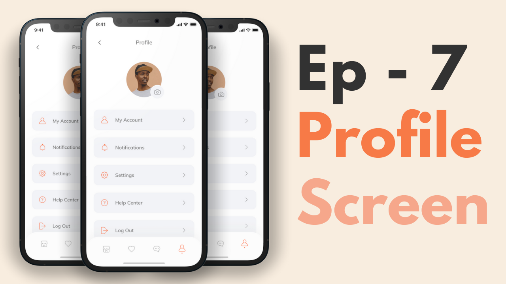

# Flutter E-Commerce App 🛍️📱

Welcome to the Flutter E-Commerce App project! This app is designed to provide a seamless shopping experience for users to browse, search, and purchase products directly from their mobile devices.

## Features

- **Product Catalog:**
  - Browse through a wide range of products with detailed descriptions and images.

- **Search Functionality:**
  - Easily search for specific products by name, category, or keyword.

- **Shopping Cart:**
  - Add products to the cart, update quantities, and proceed to checkout.

- **Secure Checkout:**
  - Integrated payment options for a secure and hassle-free checkout process.

- **User Authentication:**
  - Allow users to create accounts, log in, and manage their profiles.

## Technologies Used

- **Flutter:**
  - UI toolkit for building natively compiled applications for mobile, web, and desktop from a single codebase.

- **Firebase:**
  - Backend services for authentication, database, and hosting.

- **Third-Party Plugins:**

### Video Preview of the Shop template

## Screens it contains:

=> Onboarding
=> Login
=> Forgot Password
=> Sign Up
=> Complete Profile
=> OTP Verification
=> Home Page
=> Product Details
=> Order
=> Profile (added)
=> Bottom Navigation Bar (added)

Now it contains all the screen, thanks for your love and support 🙏

## Photos

## Preview
